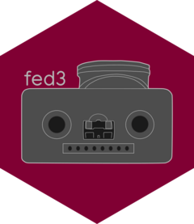

# fed3 <a href="https://matiasandina.github.io/fed3/"></a>

<!-- badges: start -->
[](https://lifecycle.r-lib.org/articles/stages.html#experimental)
[](https://CRAN.R-project.org/package=fed3)
<!-- badges: end -->

The goal of fed3 is to analyze data coming from [FED3 feeder devices from KravitzLabDevices](https://github.com/KravitzLabDevices/FED3/)

## Installation

You can install the current version of fed3 with:

``` r
# Not yet in CRAN
# install.packages("fed3")
devtools::install_github("matiasandina/fed3")
```

## Example


``` r
library(fed3)
## basic example code
```

## Docs

📖 Package documentation site [here](https://matiasandina.github.io/fed3/)

## Acknowledgements

This package draws a lot of inspiration from the [python pacakge](https://github.com/earnestt1234/fed3).

The logo reuses the fed cartoon from <a href="https://doi.org/10.5281/zenodo.5228170"></a>
